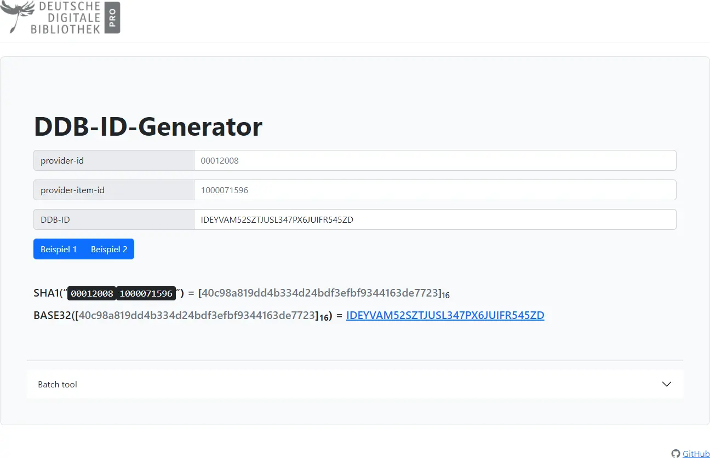

# DDB-ID-Generator

Der DDB-ID-Generator ist ein Tool, um die ID der Objekte bei der [Deutschen Digitalene Bibliothek](https://www.deutsche-digitale-bibliothek.de/) anhand der `provider-id` und der vom Datenpartner zur Verfügung gestellten `provider-item-id` zu berechnen.

Es veranschaulicht außerdem den Rechenweg, wie über den SHA1-Algorithmus und einer BASE32-Codierung die ID berechnet werden kann.