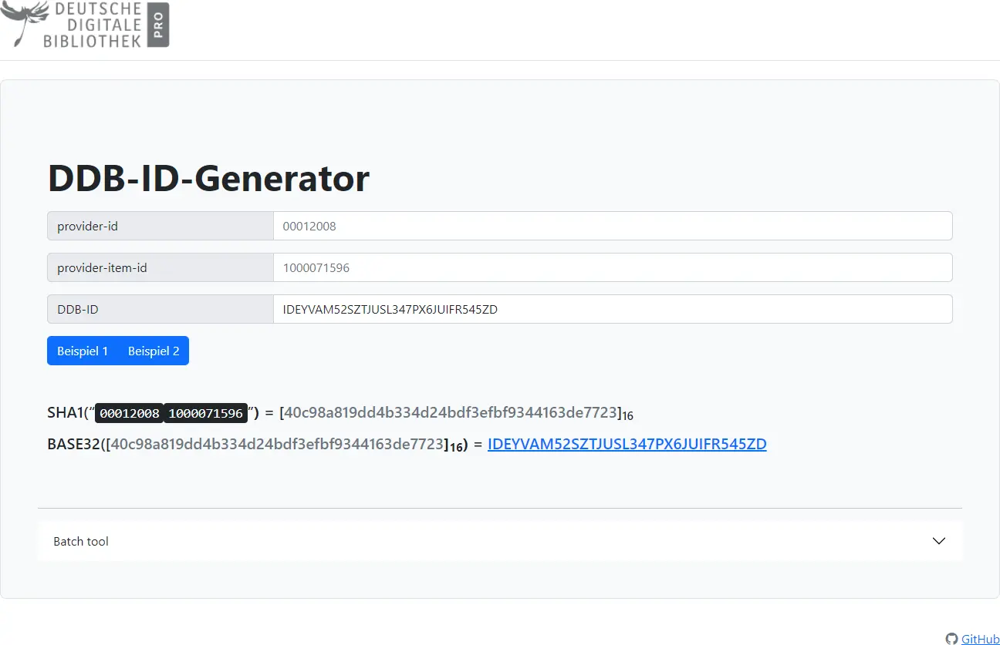

# DDB-ID-Generator

Der DDB-ID-Generator ist ein Tool, um die ID der Objekte bei der [Deutschen Digitalene Bibliothek](https://www.deutsche-digitale-bibliothek.de/) anhand der `provider-id` und der vom Datenpartner zur Verfügung gestellten `provider-item-id` zu berechnen.



Es veranschaulicht außerdem den Rechenweg, wie über den SHA1-Algorithmus und einer BASE32-Codierung die ID berechnet werden kann.

## Optimierungen in diesem Repository

- Runtime von NGINX auf Caddy umgestellt (leichter Betrieb als statische Web-App).
- Dedizierter Health-Endpunkt unter `/healthz` für stabile OpenShift-Probes.
- Kompression aktiviert (zstd, gzip).
- Cache-Header optimiert:
	- Statische Assets: langes Caching (`immutable`).
	- HTML: `no-cache`, damit Rollouts sofort sichtbar sind.
- Frontend-Skripte entschlackt:
	- jQuery und separates Popper entfernt.
	- Nur noch Bootstrap Bundle + natives JavaScript.

## Subpath per ENV

Die Anwendung wird über den ENV-Wert `APP_BASE_PATH` unter einem Subpath ausgeliefert.

- Standardwert: `/app/ddbidgen`
- Beispiel alternativ: `/tools/ddb`

Der Caddy-Server liest den Wert direkt aus der Umgebung.

## Lokaler Build

```bash
docker build -t ddbidgen:local .
docker run --rm -p 8080:8080 ddbidgen:local
```

Anwendung danach unter `http://localhost:8080/app/ddbidgen`.

Mit explizitem Subpath beim Docker-Start:

```bash
docker run --rm -p 8080:8080 -e APP_BASE_PATH=/app/ddbidgen ddbidgen:local
```

## Caddy lokal starten (ohne Docker)

Voraussetzung: Caddy ist lokal installiert.

PowerShell:

```powershell
$env:APP_ROOT = '.'
$env:APP_BASE_PATH = '/app/ddbidgen'
caddy run --config Caddyfile --adapter caddyfile
```

Test-URLs lokal:

- App: `http://localhost:8080/app/ddbidgen`
- Health: `http://localhost:8080/healthz`

Hinweis zu Port `2019`:

- `2019` ist standardmaessig der Caddy-Admin-Port (nicht die Anwendung).
- In dieser Konfiguration ist `admin off` gesetzt, daher sollte dort nichts mehr erreichbar sein.
- Wenn du die Meldung `{"error":"client is not allowed to access from origin ''"}` siehst, hast du sehr wahrscheinlich den Admin-Port statt der App-URL aufgerufen.

## OpenShift

Ein vollständiges Beispielmanifest liegt unter [openshift/k8s.yaml](openshift/k8s.yaml).

Enthalten sind:

- Deployment (2 Replikas)
- Service
- Route
- ENV `APP_BASE_PATH=/app/ddbidgen`
- startupProbe, readinessProbe, livenessProbe auf `/healthz`
- SecurityContext für restriktive Cluster

Deployment-Beispiel:

```bash
oc apply -f openshift/k8s.yaml
```

## Empfehlung für Ressourcen

Für diese statische App sind folgende Startwerte praxistauglich:

- requests: `cpu: 25m`, `memory: 64Mi`
- limits: `cpu: 250m`, `memory: 128Mi`

Falls du weiterhin Restarts siehst, zuerst Probe-Fehlschläge prüfen:

```bash
oc describe pod <pod-name>
oc logs <pod-name> --previous
```

Erst danach Limits weiter anheben.